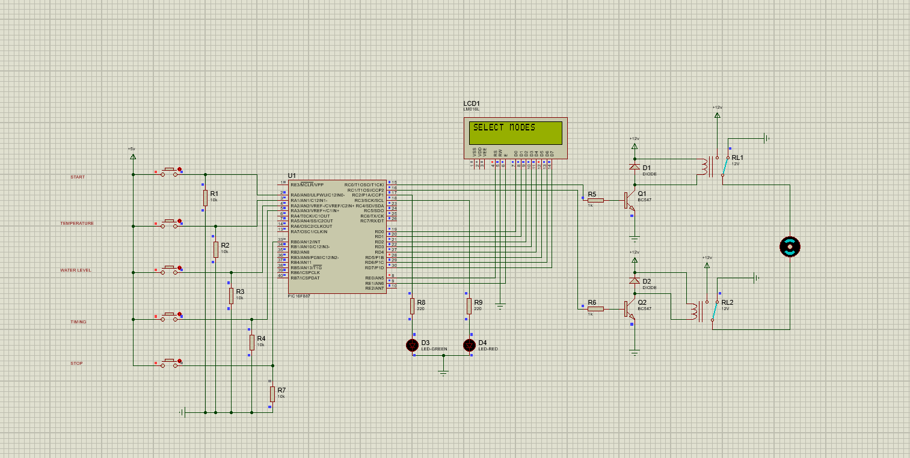
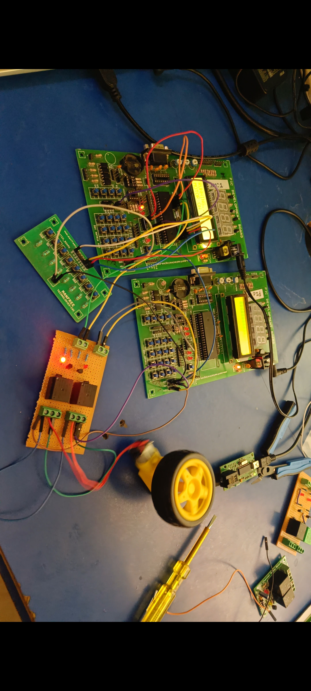

# PIC16F887 Washing Machine Controller

Embedded washing machine controller built on PIC16F887 
featuring forward/reverse motor control, LCD menu system 
and interrupt driven emergency stop.

## Features
- Temperature mode selection (20C / 30C / 40C)
- Water level selection (Level 1-5)
- Motor timing modes (5s / 10s / 15s)
- Forward and reverse motor control via relay
- LCD 16x2 display for mode indication
- Emergency stop via external interrupt (RB0)

## Tools Used
- MPLAB X IDE
- XC8 Compiler
- Proteus Simulation

## Circuit Schematic

## Real Hardware

## Known Issues
- External interrupt stop button not working 
  reliably after first trigger - under investigation
